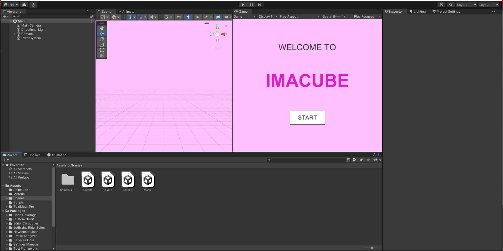
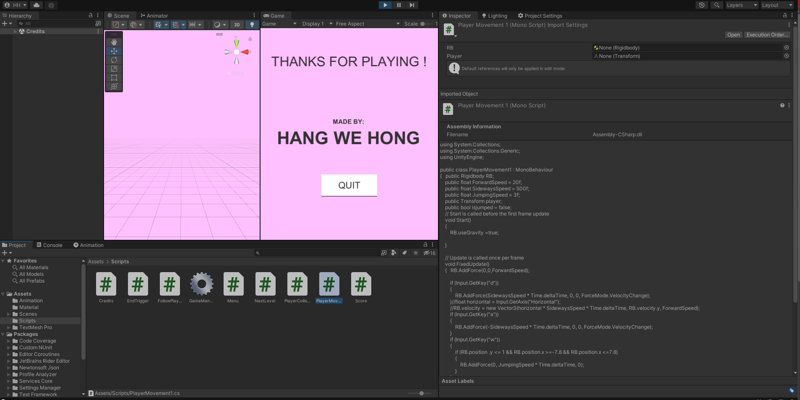
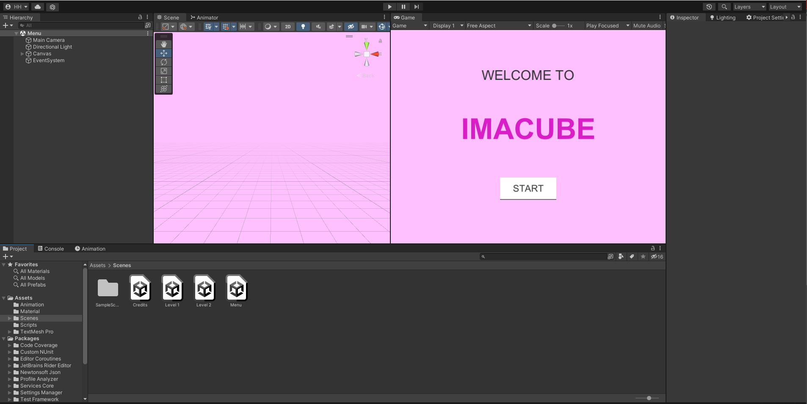
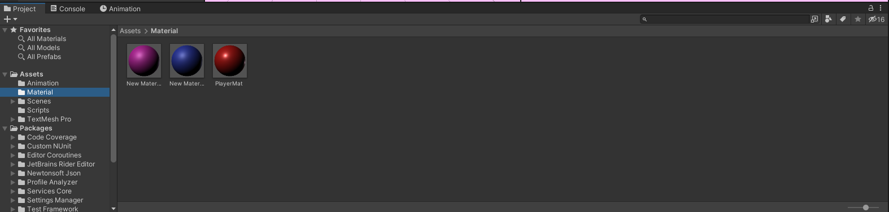
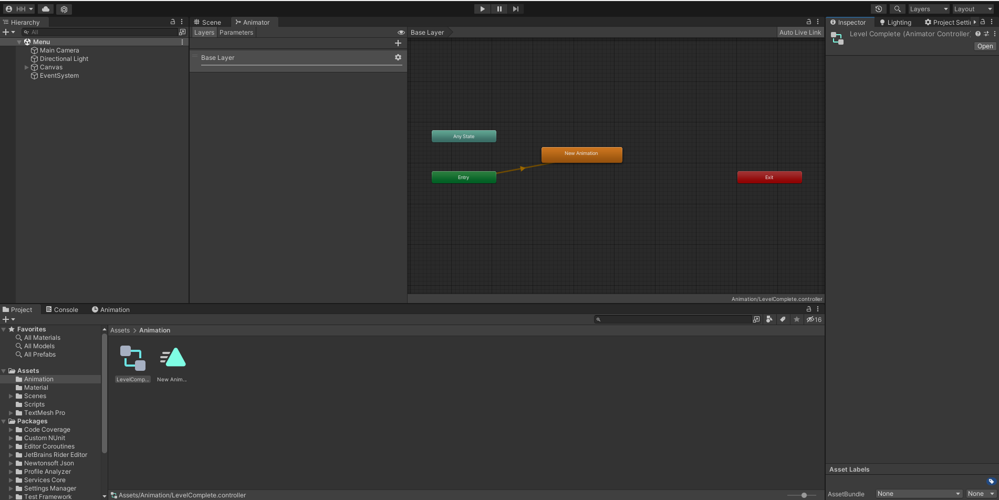

# 3D Cube Racing Game
## Open Project
- Due to the limited storage allowed by GitHub,i have uploaded the whole project files into Google Drive and pasted the link in a textfile named Project.txt.
- Download the files using the link above and open the project using Unity Hub.
- After it is opened:

## Scripts
- `Scripts` that are coded using C# to manage the interaction between each scenes and objects and control the movement of the objects in the game.
For example,one of the script PlayerMovement1 controls the keys and velocity that the 3D Object (Cube) will be moving:

You can get all the scripts by going to Assets/Scripts
##Scenes
- `Stage1,2..` included 3D objects that i have created to make up a stage, direction or angle of the camera as the cube moves,and so on.
- `Menu` is the first Scene that will appear with the name of the game and a start button
- `Credits` will be the last Scene with the credits to the creator of this game.

You can access all the scenes through Assests/Scenes

## Material
- Material will set up the colours of the objects.

You can access all the materials through Assests/Material

## Animation
- Animation that i have created for this game is to proceed through each Scenes/Stage as the player completes one stage.

You can access all the animations through Assests/Animation

### Last But Not Least, all these works are not perfect or complete,feel free to make your own cube games with better features!
